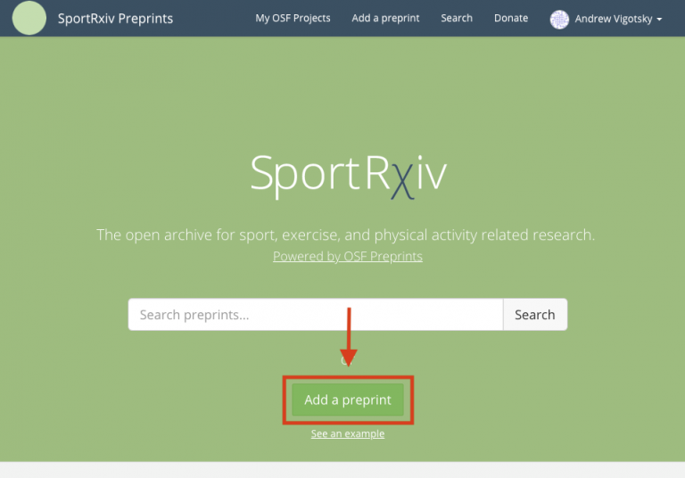

This help guide will walk you through a few easy steps to share a preprint to SportRχiv. Before getting to this stage, please ensure your potential submission meets our submission guidelines. If your article does not conform to these basic guidelines then your submission may be rejected. Next, you will first need to create an OSF account in order to upload preprints to the repository. You can do this by clicking the here.

**Using one of our [submission templates](https://osf.io/95fpe/) will likely ensure compliance with this checklist**

# Pre-Submission Checklist

1. A co-author agreement statement must be included

A declaration stating that all co-authors approve the manuscript and its submission to SportRχiv must be included in the article (preferably on the cover page). For example:

> Co-Author Agreement: We the authors agree to the sharing of this preprint on SporRχiv 

2. There must be a statement on the cover page that the work is pre or post- print

Our readers need to know whether or not the submission is pre-peer review (preprint) or has been accepted for publication at a peer-reviewed journal elsewhere (postprint). This statement can be put in the header or footer of the article. If the article is a postprint please consider adding a link to the accepted journal article once it is available.

3. The article DOI must be reported in the article

The document object identifier (DOI) for each submission is minted once the article has been accepted by our moderators. However, we encourage authors to include a space for this to added on the cover page of the article (see example below). Once the DOI is minted, it is expected that authors add the DOI to the cover page within 7 days.

4. The manuscript’s citation must be included on the cover page

An example of a citation for the article must be included on the front cover. An exact citation style (e.g., APA) is not required.

When ready, the final submission’s cover page should look similar to the image below.

5. Ensure that the manuscript meets basic scientific reporting standards

Reporting standards vary from article type and field. Please check EQUATOR Network’s list of guidelines to ensure your article meets the required reporting standards (https://www.equator-network.org/).

6. Convert your submission to portable document file (PDF)

This file type is needed to ensure your submission is readable on our website.

## Submitting your manuscript

Make sure that you are uploading your preprint to SportRχiv. Please make sure to navigate to https://osf.io/preprints/sportrxiv/ to avoid your preprint being misplaced. If you’re not sure we are the best fit for your work, please use the Find a Preprint Service for help.

On the preprint service landing page, click the Add a preprint button.

Please see the Open Science Framework's [guide](https://help.osf.io/hc/en-us/articles/360019930553-Submitting-to-a-Moderated-Preprint-Service) to submitting to a moderated server for exact step-by-step details on how to upload your manuscript to our server.